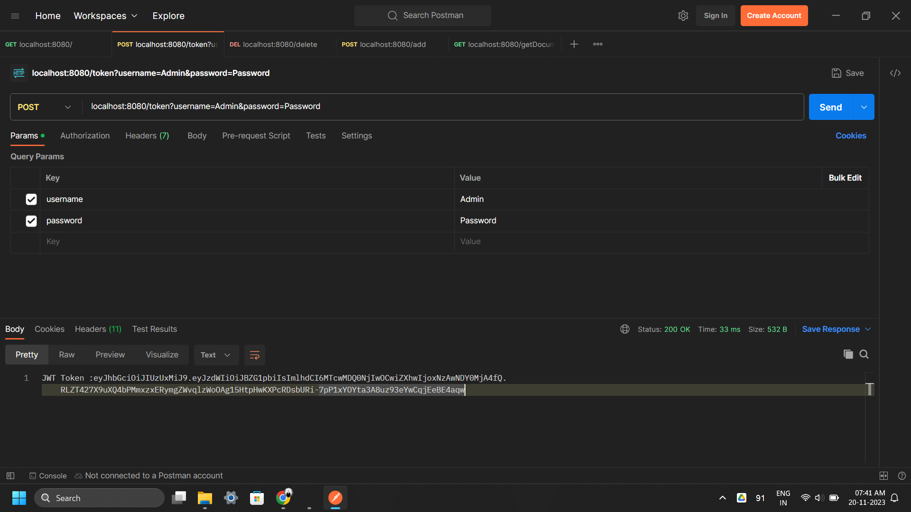
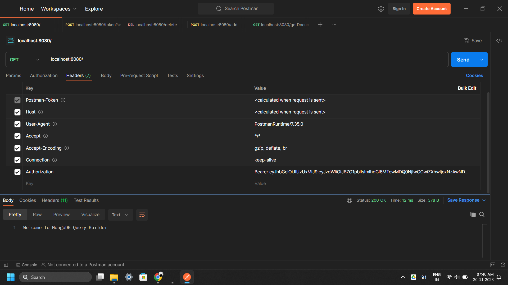
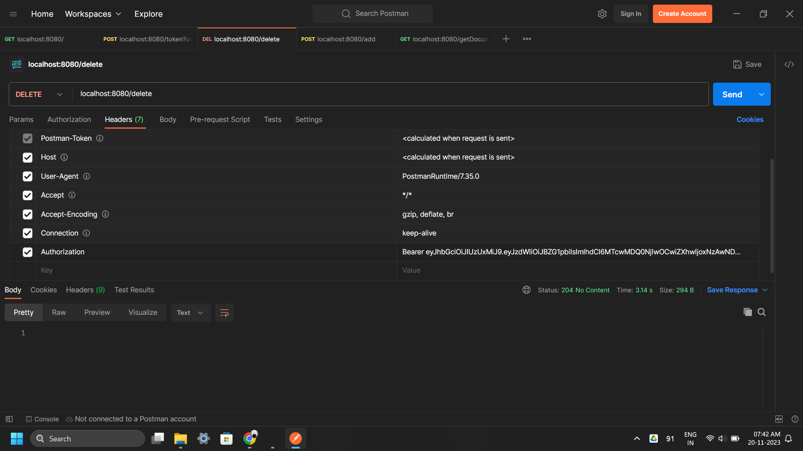
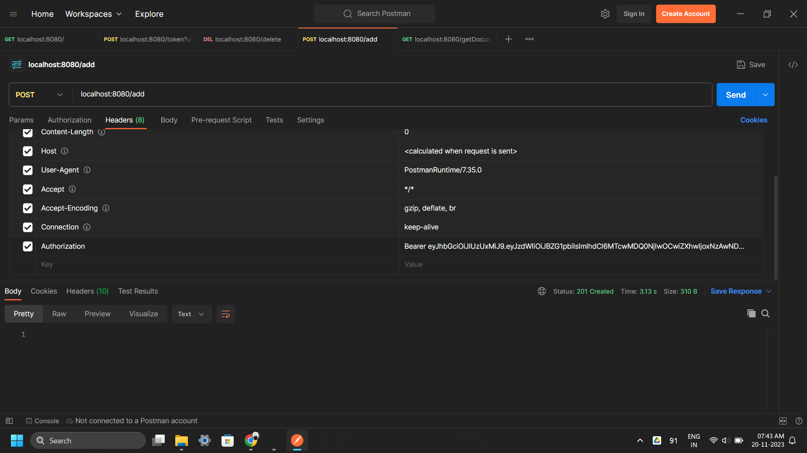
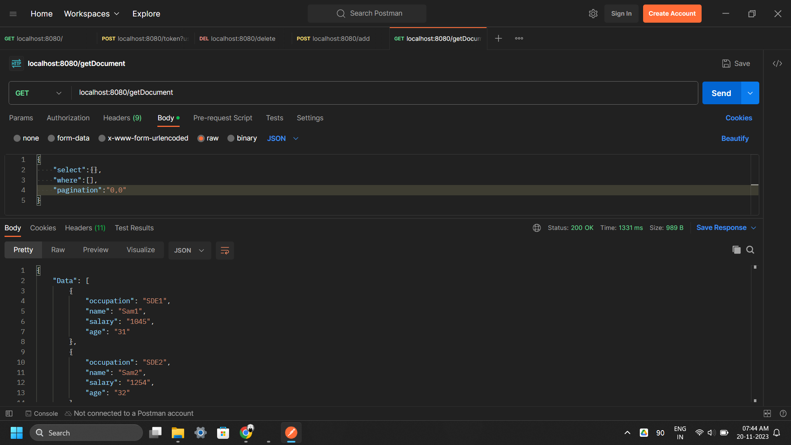

# Query-Builder
MongoDB Query Builder (JWT Authentication)

## Features
- MongoDB NOSQL Database (JSON)
- Spring Security with JWT Authentication
- lombok
- Spring Data Validation
- HTTP Status and Methods
- Exception Handling Using Global Exception and Custom Exception
- Solid Principles
- Easy to Understand Code
 

## Installation
- Just, Clone this repository - 
````bash 
git clone https://github.com/SLoharkar/Query-Builder.git
````
- Run File Using Any Java Application Like Eclipse IDE For Java Developer or Visual Studio Code


## Website Trailer

https://github.com/SLoharkar/Query-Builder/assets/68845746/bde724b1-f39f-463d-8917-76faf954be9a


## Website Highlights
<p align="left" width="100%">












</p>


## Dependencies
- `Visual Studio Code (VS Code)`
- `java-11`
- `Spring Boot Version 2.7.8`
- `Postman`
- `Windows 11`

